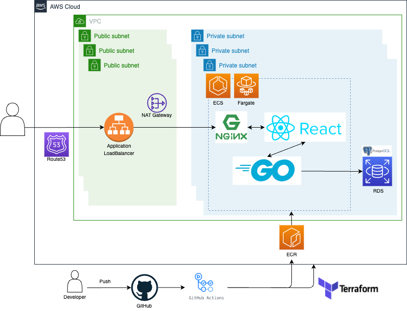

# LearnLocale: Connect with Your Ideal Study Environment
### Note: A Japanese translation of this document follows the English version.
LearnLocale is a web application crafted to assist students and self-learners in finding the ideal place for study. Be it the serene ambiance of a library or the vivacious energy of a café, our database of study locations, enriched by contributions from our users, makes it convenient for you to uncover new and effective study spots.

As a registered user, your contributions to the community are invaluable. Add new locations, specify their operating hours, and bookmark your favorite spots. You can also craft and share reviews, assisting others in finding the ideal spot.

For those without an account, you can still delve into the extensive information our community has to offer. Peruse various locations, their hours of operation, and read reviews to decide on your next study retreat.

## Tech Stack
LearnLocale boasts a blend of various technologies:

- React (SPA): The user interface is a Single Page Application (SPA) crafted using React, offering dynamic updates and reduced page reloads for a seamless user experience.
- Jest: Employed as the testing framework for React.
- Go & Gin: Go, coupled with the Gin HTTP web framework, forms the backbone of the server-side logic.
- JWT (JSON Web Tokens): Implemented for secure authentication and information exchange.
- PostgreSQL: Chosen for robust and reliable data storage.
- Docker & Docker-compose: Ensures consistent application behavior across various environments.
- AWS (Amazon Web Services): Provides a scalable and reliable platform for hosting the application and associated services.
- ECS Fargate & ECR: Used to run, manage, and store Docker containers.
- RDS: Powers our cloud-based PostgreSQL database.
- Terraform: Streamlines the provisioning process of our cloud infrastructure.
- GitHub Actions & CI/CD: Automates the development workflows, including testing and deployment.

## Infrastructure Architecture
Below is the infrastructure architecture diagram for LearnLocale. This diagram illustrates how the different technologies and services are orchestrated to support the application's infrastructure:

## Getting Started
To have a local copy up and running, adhere to the following steps:

### Prerequisites
- Install Docker and Docker-compose.

### Installation
1. Clone the repository:

`git clone https://github.com/tkohei07/personal-project.git `

2. Navigate to the project directory:

`cd personal-project` 

3. Install the required npm packages:

`npm install` 

4. Set the .env.local file that includes...
- REACT_APP_BACKEND=http://localhost:8080
- REACT_APP_GOOGLEMAPS_API_KEY=(your own API key if you want).

5. To initiate the application locally with Docker, execute:

`docker-compose up` 

This will spawn Docker containers for your application and start them.

## Testing
Run Frontend Test:

`docker-compose run --rm -e CI=true client sh -c "npm test -- --coverage --watchAll=false"`

Run Backend Test:

`docker-compose run --rm server go test ./cmd/api/...`

`docker-compose run --rm server go test ./internal/repository/dbrepo/...`

On successful test execution, the workflow will display "Tests passed". If any test fails, it will report "Tests failed" and exit with a non-zero status.

## Deployment
The application is hosted on AWS, using a blend of ECS Fargate for running Docker containers, ECR for storing Docker images, and RDS for the PostgreSQL database. Infrastructure management and provisioning is accomplished via Terraform.

## License
This project is released under the Unlicense, which means it's open-source. You have the freedom to use, copy, modify, merge, publish, distribute, sublicense, and/or sell copies of the final products.

## Author
Kohei Tagai

[GitHub Pages](https://github.com/tkohei07)

For queries, suggestions, or contributions to the project, feel free to reach out.

Email: tagai@wisc.edu

# The Japanese version begins from here:

LearnLocaleは、学生や自習者が最適な勉強場所を見つけるためのWebアプリケーションです。図書館やカフェ、学校が提供する休憩スペースなど、自分に合った勉強場所を見つけることができます。

ユーザ登録すると、新しい勉強場所を追加したり、お気に入りの場所をブックマークすることもできます。また、レビューを作成して他のユーザと共有することもできます。

また、アカウントを持っていない方でも、学習コミュニティが提供する豊富な情報を閲覧できます。

## 技術スタック
LearnLocaleは、以下の技術を使用しております。

- React (SPA)
- Jest
- Go & Gin
- JWT
- PostgreSQL
- Docker & Docker-compose
- AWS（ECS Fargate、ECR、RDS）
- Terraform
- GitHub Actions & CI/CD

## インフラ構成図
以下がLearnLocaleのインフラ構成図です。

### 以降の部分は英語版をご参照ください。
